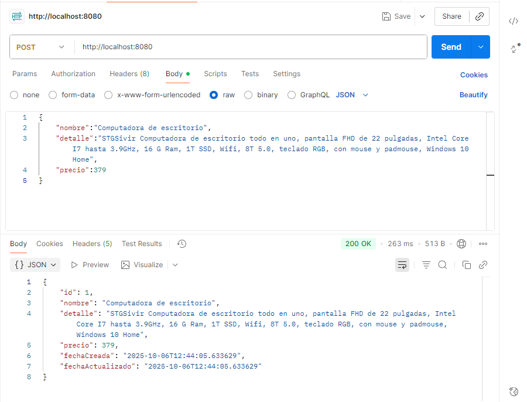
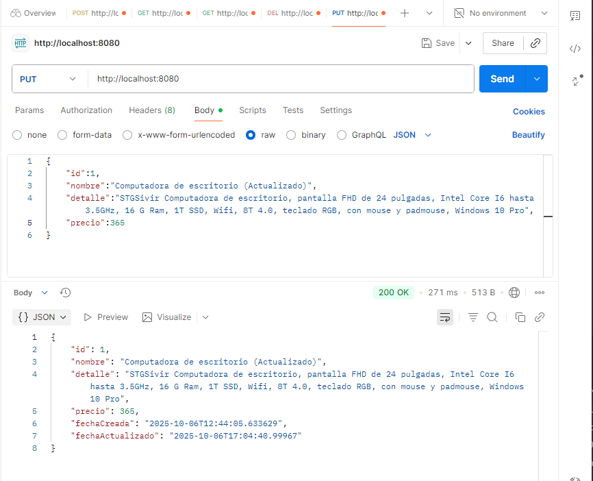
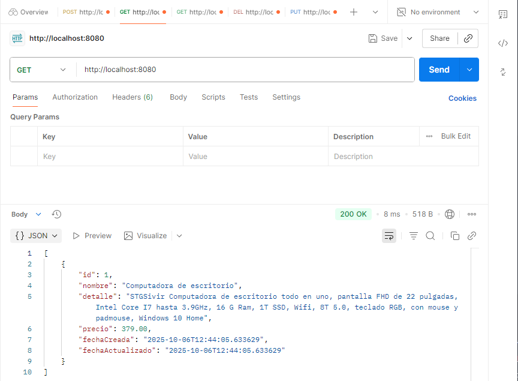

# 🧩 Ejemplo Básico de API RESTful con Spring Boot, JPA y MySQL

Este proyecto es un ejemplo práctico de cómo construir una **API RESTful** utilizando **Spring Boot**, **Spring Data JPA** y **MySQL**.  
Permite realizar operaciones básicas **CRUD (Create, Read, Update, Delete)** sobre una entidad llamada `Producto`.

---

## 🚀 Tecnologías utilizadas

- **Java 17**
- **Spring Boot 3.x**
- **Spring Web**
- **Spring Data JPA**
- **MySQL**
- **Postman** (para pruebas de endpoints)
- **Maven** (gestor de dependencias)

---

## 🧱 Estructura del proyecto

    src/
    ├── main/
    │ ├── java/com/example/demo/
    │ │ ├── controller/ProductoController.java
    │ │ ├── entity/Producto.java
    │ │ ├── repository/ProductoRepository.java
    │ │ └── DemoApplication.java
    │ └── resources/
    │ ├── application.properties
    │ └── data.sql (opcional)
    └── test/


---

## ⚙️ Configuración de la base de datos

En el archivo `application.properties` debes configurar la conexión con MySQL:

    ```properties
    spring.datasource.url=jdbc:mysql://localhost:3306/tienda?useSSL=false
    spring.datasource.username=root
    spring.datasource.password=tu_contraseña
    spring.jpa.hibernate.ddl-auto=update
    spring.jpa.show-sql=true
    spring.jpa.properties.hibernate.format_sql=true


---

## 🧩 Entidad Producto


    @Entity
    public class Producto {
        @Id
        @GeneratedValue(strategy = GenerationType.IDENTITY)
        private Long id;

        private String nombre;
        private String detalle;
        private Double precio;

        private LocalDateTime fechaCreada;
        private LocalDateTime fechaActualizado;
    }

## 🌐 Endpoints disponibles

| Método | Endpoint        | Descripción                         |
|:-------|:----------------|:------------------------------------|
| **GET**    | `/`               | Obtiene todos los productos.         |
| **POST**   | `/`               | Guarda un nuevo producto.            |
| **PUT**    | `/`               | Actualiza un producto existente.     |
| **DELETE** | `/{id}`           | Elimina un producto por su ID.       |

---

## 🧪 Ejemplos de uso (Postman)

### **1️⃣ Crear producto (POST)**

**URL:** `http://localhost:8080`  
**Body (JSON):**
    
    {
    "nombre": "Computadora de escritorio",
    "detalle": "STGSivir Computadora de escritorio todo en uno, pantalla FHD de 22 pulgadas, Intel Core I7 hasta 3.9GHz, 16 G Ram, 1T SSD, Wifi, 8T 5.0, teclado RGB, con mouse y padmouse, Windows 10 Home",
    "precio": 379
    }
Respuesta (201 Created / 200 OK):

    {
    "id": 1,
    "nombre": "Computadora de escritorio",
    "detalle": "STGSivir Computadora de escritorio todo en uno...",
    "precio": 379,
    "fechaCreada": "2025-10-06T12:44:05.633629",
    "fechaActualizado": "2025-10-06T12:44:05.633629"
    }

📷 Ejemplo en Postman:



## 2️⃣ Actualizar producto (PUT)

**URL:** `http://localhost:8080`  
**Body (JSON):**

    {
    "id": 1,
    "nombre": "Computadora de escritorio (Actualizado)",
    "detalle": "STGSivir Computadora de escritorio, pantalla FHD de 24 pulgadas, Intel Core I6 hasta 3.5GHz, 16 G Ram, 1T SSD, Wifi, 8T 4.0, teclado RGB, con mouse y padmouse, Windows 10 Pro",
    "precio": 365
    }

Respuesta (200 OK):

    {
    "id": 1,
    "nombre": "Computadora de escritorio (Actualizado)",
    "detalle": "STGSivir Computadora de escritorio, pantalla FHD de 24 pulgadas...",
    "precio": 365,
    "fechaCreada": "2025-10-06T12:44:05.633629",
    "fechaActualizado": "2025-10-06T17:04:40.99967"
    }

📷 Ejemplo en Postman:



## 3️⃣ Obtener productos (GET)

**URL:** `http://localhost:8080`  
**Body (JSON):**

Respuesta (200 OK):

    [
    {
        "id": 1,
        "nombre": "Computadora de escritorio",
        "detalle": "STGSivir Computadora de escritorio todo en uno...",
        "precio": 379,
        "fechaCreada": "2025-10-06T12:44:05.633629",
        "fechaActualizado": "2025-10-06T12:44:05.633629"
    }
    ]

📷 Ejemplo en Postman:



## 4️⃣ Eliminar producto (DELETE)

**URL:** `http://localhost:8080`  
**Ejemplo:** `http://localhost:8080/2`  

Respuesta (200 OK o 204 No Content):

    {
    "mensaje": "Producto eliminado correctamente."
    }

📘 Nota: Este endpoint elimina el producto del sistema según el id especificado.
Si el producto no existe, el backend puede responder con un código 404 Not Found.

## 🧹 Posibles mejoras futuras

- ✅ Agregar manejo de excepciones personalizadas (por ejemplo, producto no encontrado).  
- ✅ Implementar validaciones de entrada con anotaciones como `@Valid`, `@NotNull`, `@Size`, etc.  
- ✅ Añadir una capa de servicio (`@Service`) para una mejor separación de responsabilidades.  
- ✅ Incluir logs para depuración utilizando `@Slf4j` o `LoggerFactory`.  
- ✅ Integrar **Swagger / OpenAPI** para generar documentación automática de la API.  
- ✅ Implementar pruebas unitarias y de integración con **JUnit 5** y **MockMvc**.  
- ✅ Añadir manejo global de errores con `@ControllerAdvice` y `@ExceptionHandler`.  
- ✅ Permitir búsqueda de productos por nombre, rango de precios u otros filtros.  
- ✅ Incorporar paginación y ordenamiento mediante `Pageable` y `Sort`.  
- ✅ Agregar capa de seguridad básica con **Spring Security** y autenticación JWT.  
